# MOM

## SOA

```mermaid
graph LR
    mono["
        <center>
            Monolithic Application
            <br/>
            🍎 🍐 🍊 🍋
        </center>
    "]

    serv1["MicroService 🍎"]
    serv2["MicroService 🍐"]
    serv3["MicroService 🍊"]
    serv4["MicroService 🍋"]

    serv1 --> serv2
    serv2 --> serv3
    serv1 --> serv4
```

- Small services
- Communication with lightweight mechanisms
- Built around business capabilities
- Independently deployable 

## Communication mechanism

### Synchronous / Asynchronous

- Synchronous

Often an HTTP resource API.

- Asynchronous

Often an AMQP broker.

### Single receiver / multiple receivers

- Single receiver

```mermaid
graph LR
    serv1["MicroService 🍎"]
    serv2["MicroService 🍐"]
    serv3["MicroService 🍊"]
    broker["Broker 🚚"]

    serv1-->broker
    broker-->serv2
    broker-.->serv3
```

Load balancing

- Multiple receivers

```mermaid
graph LR
    serv1["MicroService 🍎"]
    serv2["MicroService 🍐"]
    serv3["MicroService 🍊"]
    broker["Broker 🚚"]

    serv1-->broker
    broker-->serv2
    broker-->serv3
```

Publish/Subscribe

