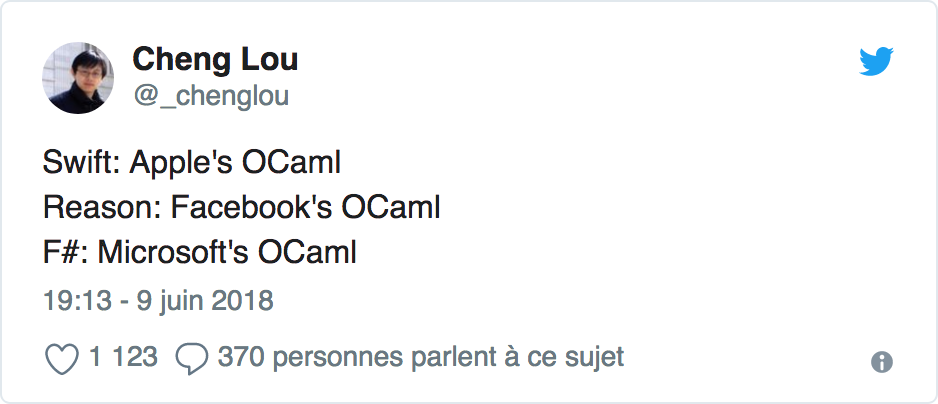

# 



- OCaml syntax for JS programmers


## Always returns value

```reason
let add = (x, y) => {
    x + y;
};

let five = add(2, 3);


let add = (x, y) => x + y;
let add = (x) => (y) => x + y;
let add2 = add(2);
let five = add2(3);


let three = {
    let x = 1;
    let y = 3;
    add(x, y);
};

let four = if (true) 4 else 3;

let concat = (x, y, z) => x ++ y ++ z;

let bca = "a" |> concat("b", "c");
let abc = "a" -> concat("b", "c");

let bac = "a" |> concat("b", _, "c");
let bac' = "a" -> concat("b", _, "c");


let contains: (string, char) => bool =
	String.contains;
let concat: (string, list(string)) => string =
	String.concat;

let true_ =
  ["a", "b", "c"]
  |> concat("")
  |. contains('b');

type option('a) = None | Some('a);


let print = message => {
  print_endline(message);
  ();
};


let div = (x, y) =>
  switch (y) {
    | 0 => None
    | _ => Some(x / y)
  };

```

### Void ?

```reason
type maybe =
  | Some(int)
  | Just(string)
  | None;

let string_of_maybe = maybe =>
  switch (maybe) {
  | Just(x) => "Just(" ++ x ++ ")"
  | Some(1) => "Some(1)"
  | Some(x) when x mod 2 == 0 => "Some(%2)"
  | None => "None"
  | _ => "Some(_)"
  };

let ageAndName: (int, string) = (24, "Lil' Reason");

type coord3d = (float, float, float);
let my3dCoordinates: coord3d = (20.0, 30.5, 100.0);

type person = {
  age: int,
  name: string
};

let me = {
  age: 5,
  name: "Big Reason"
};

let name = me.name;

let meNextYear = {...me, age: me.age + 1};
```


```reason
/* inline */
let add = (x, y) => x + y;
let add = (x) => (y) => x + y;

/* with block */
let add = (x, y) => {
    x + y
};

/* labeled params
let add = (~first, ~second) => {
    first + second
};
```