# AWS

## Compute
- [x] Elastic Compute Cloud
- [x] Elastic Container Service
- [x] Elastic Container Registry
- [x] Batch
- [x] Fargate
- [x] Lambda

## Storage
- [x] Simple Storage Service
- [x] Elastic Bloc Storage
- [x] Glacier

## Database
- [x] Aurora
- [x] Relational Database Service
- [x] DynamoDB
- [x] ElastiCache

## Networking
- [x] Virtual Private Cloud
- [x] CloudFront
- [x] Route 53
- [x] API Gateway
- [x] Elastic Load Balancing

## Depeloper Tools
- [x] CodeBuild
- [x] CodeDeploy
- [x] CodePipeline

## Management tools
- [x] CloudWatch
- [x] CloudFormation

## Analytics
- [x] Elasticsearch Service
- [x] ~EMR~
- [x] Kinesis

## Security, identity & compliance
- [x] Identity and Access Management

## Application Integration
- [x] Simple Queue Service
- [x] Simple Notification Service

# Identity and Access Management


- Users
- Groups

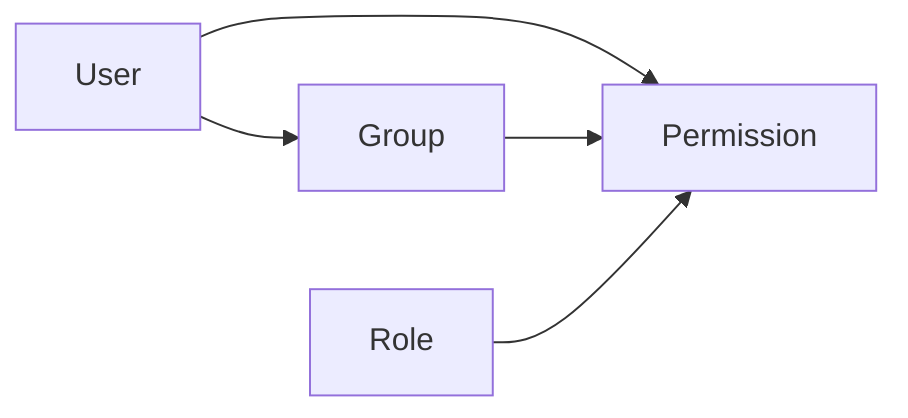

# Elastic Compute Cloud


- On-Demand instances
- 86 instance's types
- Smaller t2.nano 0.0058$/h 1vCPU 0.5G.RAM
- Bigger p3.16xlarge 24.48$/h 32vCPU 488G.RAM
- 86 instance's types
    - General Purpose
    - Compute Optimized
    - GPU Instances
    - Memory Optimized
    - Storage Optimized

# Elastic Container Registry


Fully-managed Docker container registry.

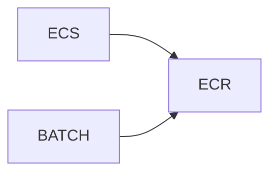

# Elastic Container Service


Container orchestration service.

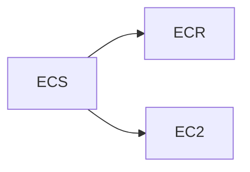

# Batch


Fully Managed Batch Processing at Any Scale.

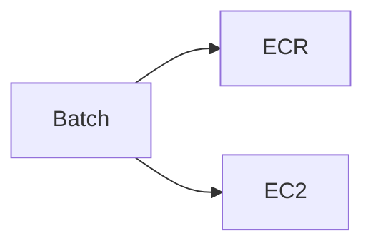

# Fargate

Compute engine for ECS and ECK without having to manage servers.

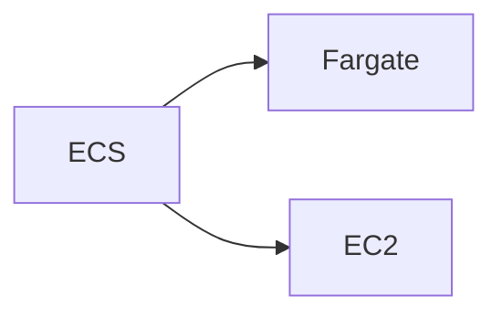

# Lambda


Run code without thinking about servers. Pay only for the compute time you consume.

Supported languages
- .NET
- Go
- Java
- Node.js
- Python

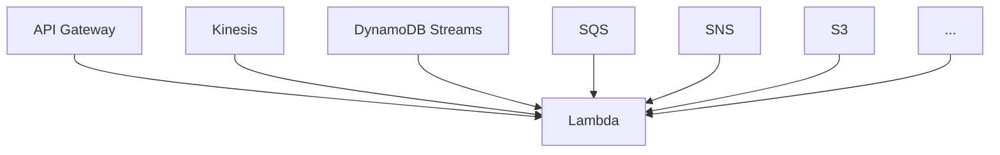

# Simple Storage Service


Object storage built to store and retrieve any amount of data from anywhere

# Elastic Bloc Storage

Persistent block storage for Amazon EC2.

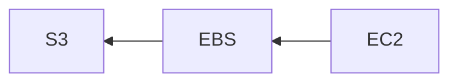

# Glacier


Long-term, secure, durable object storage for data archiving

- S3: 0.023$/month/Go
- Glacier: 0.004$/month/Go

# Relational Database Service


Managed relational database service

Engines:
- Aurora
- PostgreSQL
- MySQL
- MariaDB
- Oracle
- MSSQL

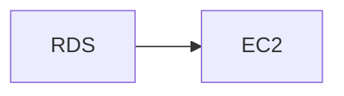

# Aurora

MySQL and PostgreSQL compatible relational database built for the cloud.

- 1/10th the cost

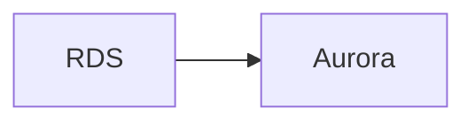

# DynamoDB


Nonrelational database for applications that need performance at any scale

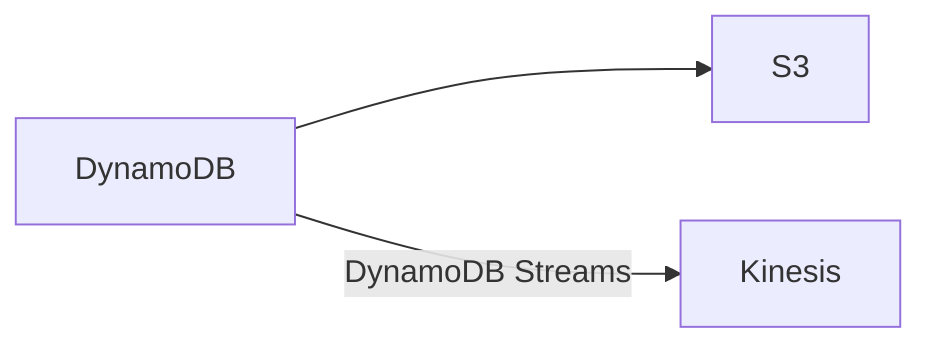

# ElastiCache


Managed, in-memory data store services.

Engines:
- Memcached
- Redis

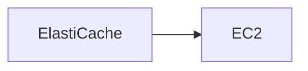

# Elasticsearch Service


Fully managed, reliable, and scalable Elasticsearch service.

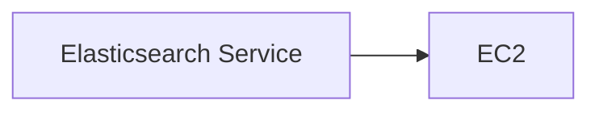

# Elastic MapReduce


A managed Hadoop framework

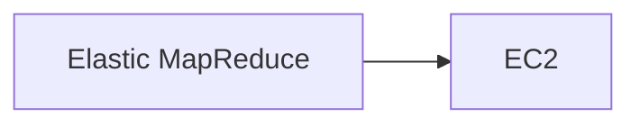

# Kinesis


With Amazon Kinesis, you can ingest real-time data such as video, audio, application logs, website clickstreams, and IoT telemetry data for machine learning, analytics, and other applications.

# Simple Queue Service


A fully managed message queuing service.

# Simple Notification Service


Pub/Sub messaging and mobile notifications

# Virtual Private Cloud


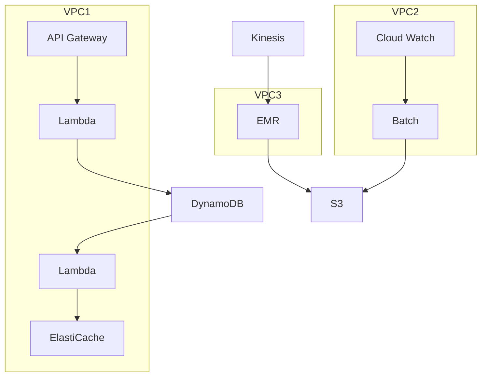

# CloudFront


Highly programmable, secure content delivery network (CDN)

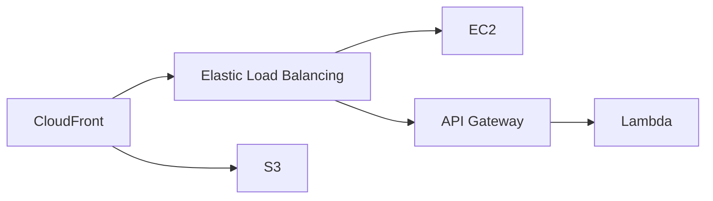

# Route 53


A highly available and scalable cloud Domain Name System.

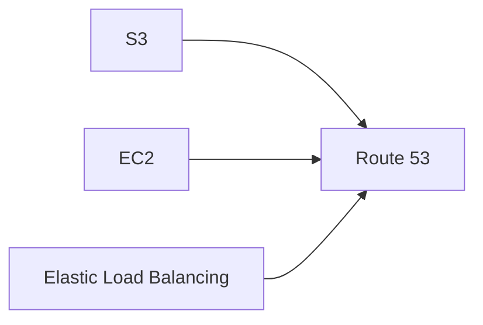

# API Gateway


A fully managed service that makes it easy for developers to create, publish, maintain, monitor, and secure APIs at any scale.

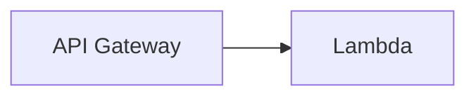

# Elastic Load Balancing


Automatically distributes incoming application traffic across multiple targets.

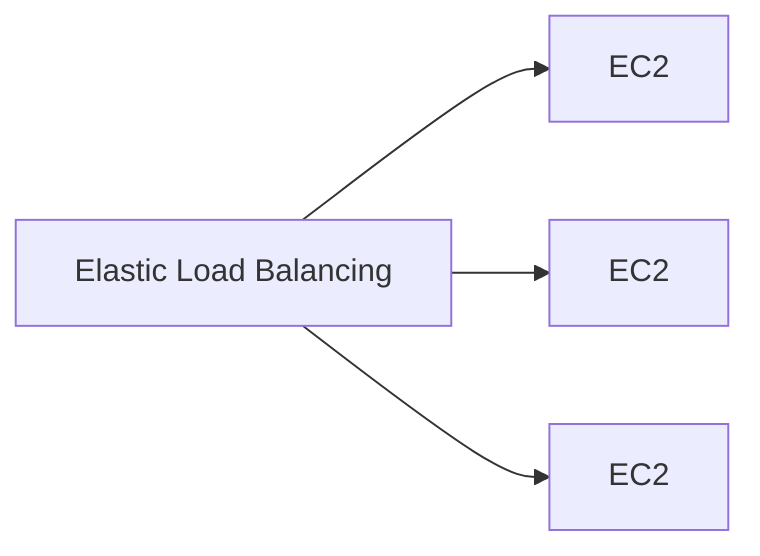

# CloudWatch


A monitoring and management service.

- Collect
- Monitor
- Act
- Analyze

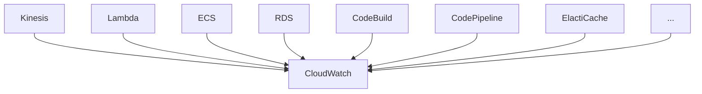

# CodeBuild


Build and test code.

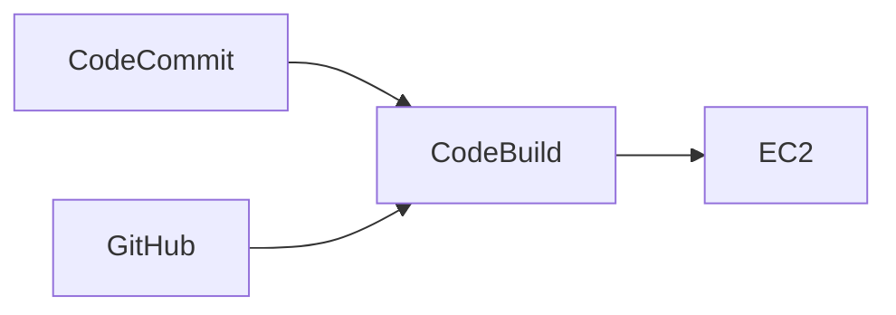

# CodeDeploy


A service that automates software deployments.

- Blue/green deployments
- Stop and rollback

```mermaid
graph LR
    CodeDeploy-->EC2
    CodeDeploy-->Lambda
```

# CodePipeline


A continuous integration and continuous delivery service.

```mermaid
graph LR
    CodeCommit-->CodeBuild
    GitHub-->CodeBuild
    CodeCommit-->Jenkins
    GitHub-->Jenkins
    subgraph CodePipeline
        CodeBuild-->CodeDeploy
        Jenkins-->CodeDeploy
        Jenkins-->EB[Elastic Beanstalk]
        CodeBuild-->EB
        Jenkins-->ECS
        CodeBuild-->ECS
    end
```

# CloudFormation


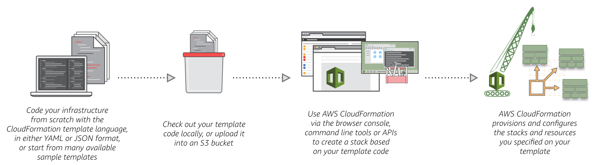
