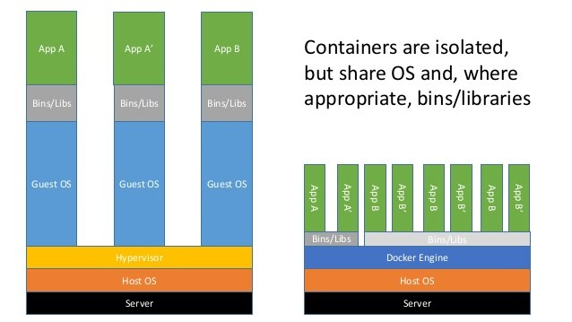

# Getting started



Goals
- isolate execution context of process
- easy to replicate

Virtualization
- guest OS
- reserve resources: CPU RAM DISK

Containerization
- mutualize host OS
- shared hardware resources : CPU RAM DISK NET

`https://hub.docker.com/_/node/`

```shell
$ docker pull node
Using default tag: latest
latest: Pulling from library/node
54f7e8ac135a: Downloading  14.72MB/45.32MB
d6341e30912f: Download complete
087a57faf949: Download complete
5d71636fb824: Downloading  13.24MB/50.06MB
0c1db9598990: Downloading   25.3MB/213.2MB
89669bc2deb2: Waiting
5b16867e793a: Waiting
e41bca16dd60: Waiting


```


```shell
$ docker run node node --eval "console.log('Hello World');"
Hello World
```

For interactive processes (like a shell), you must use `-i -t` together in order to allocate a tty for the container process.

```shell
$ docker run --help
...
-i, --interactive                    Keep STDIN open even if not attached
-t, --tty                            Allocate a pseudo-TTY
...
```

```shell
$ docker run -it node node
>
```

```shell
$ docker run node node ./index.js
internal/modules/cjs/loader.js:589
    throw err;
    ^

Error: Cannot find module '/index.js'
    at Function.Module._resolveFilename (internal/modules/cjs/loader.js:587:15)
    at Function.Module._load (internal/modules/cjs/loader.js:513:25)
    at Function.Module.runMain (internal/modules/cjs/loader.js:760:12)
    at startup (internal/bootstrap/node.js:308:19)
    at bootstrapNodeJSCore (internal/bootstrap/node.js:878:3)
```

## File system isolation
We need to mount folder and set working directory.

```
$ docker run -it -v $(pwd):/app -w /app node node ./index.js
Server running at http://0.0.0.0:3000/

$ curl http://localhost:3000
curl: (7) Failed to connect to localhost port 3000: Connection refused
```

## Network isolation

By default, all containers have networking enable, they can make any outgoing connections.

We can completely disable network with `--network none`.

### Host

A container could use directly host's network stack with `--network host`. It gives significantly better networking **performance** but it gives container full access to local inter-process communication and it is therefore considered **insecure**.

```shell
$ docker run -it -v $(pwd):/app -w /app --network host node node ./index.js
Server running at http://0.0.0.0:3000/

$ curl http://localhost:3000
Hello World
```

### Bridge

In bridge mode, we can publish container's port to host network, add `-p 80:3000`.


```shell
$ docker run -it -v $(pwd):/app -w /app -p 80:3000 node node ./index.js
Server running at http://0.0.0.0:3000/

$ curl http://localhost:80
Hello World
```

## MISC

Use docker's iamge like any other CLI tool.

```shell
$ alias node='docker run -it --rm -v $(pwd):/app -w /app --network host node node'
```

## /!\ Size

```shell
$ docker pull node:alpine
```

```shell
$ docker images
REPOSITORY  TAG     IMAGE ID        CREATED         SIZE
node        latest  4e4c445311e6    13 days ago     894MB
node        alpine  4b3c025f5508    13 days ago     71.3MB
```

Mais ça n'a pas d'incidence sur lors de l'execution.

```shell
$ docker stats
CONTAINER ID    NAME            CPU %   MEM USAGE / LIMIT       MEM %   NET I/O     BLOCK I/O   PIDS
bbd72bef3123    node_ubuntu     0.00%   8.082MiB / 1.952GiB     0.40%   968B / 0B   0B / 0B     11
8da10d1149b0    node_alpine     0.00%   9.293MiB / 1.952GiB     0.46%   718B / 0B   0B / 0B     11
```

## `Dockerfile`

```Dockerfile
FROM node

RUN mkdir -p /app
WORKDIR /app

COPY package.json package-lock.json index.js test.js /app/
RUN npm install
CMD [ "npm", "start" ]
```

```shell
$ docker build -t webserver .
$ docker run -p 3000:3000 webserver

> webserver@1.0.0 start /app
> node index.js

Server running at http://0.0.0.0:3000/
```

```shell
$ docker images
REPOSITORY  TAG     IMAGE ID        CREATED         SIZE
webserver   latest  832a921be21f    20 seconds ago  919MB
```

```shell
$ docker images
REPOSITORY  TAG     IMAGE ID        CREATED         SIZE
webserver   latest  832a921be21f    20 seconds ago  71.5MB
```

### Reference

- `FROM <baseImage>`
- `RUN <command>`
- `COPY <src> <dest>`
- `ENV <key> <value>`
- `ENTRYPOINT <command>`
- `CMD <command>`
- `ARG <key>[=<defaultValue>]`

# Compose

## Commands

```shell
docker-compose build
docker-compose create start
docker-compose run test
docker-compose start
docker-compose stop
docker-compose rm
```

## `docker-compose.yml`

```yaml
version: '3.7'
services:
  webserver:
    build: .
    ports:
      - 3000:3000
```

### Links

## Bonne pratique

- un thread par image

# Docker Registry
# Machine

# Swarm / Kubernetes / ECS

# Universal Control Plan