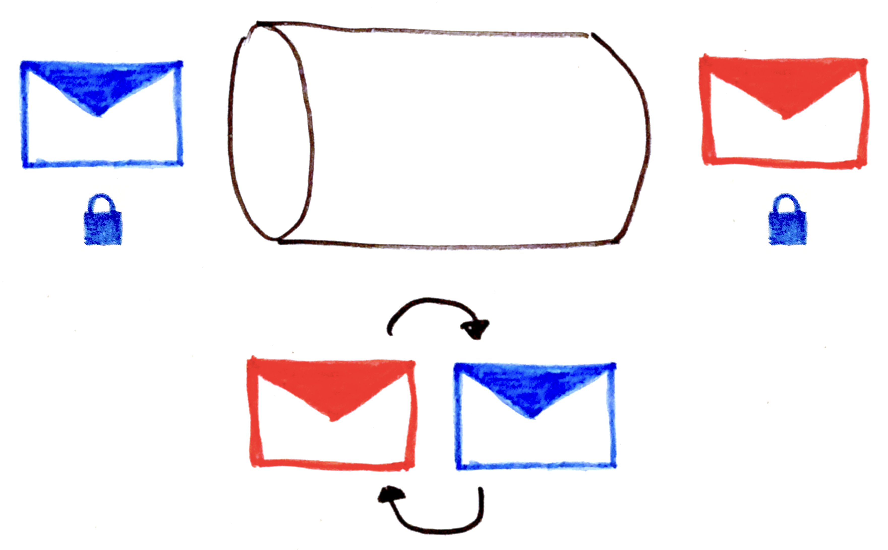

---

---

# Cyclic redundancy check

***

## Error detection

---

---

---

> **A hash function** is any function that can be used to map data of **arbitrary size** onto data of a **fixed size**.

---

> The values returned by a hash function are called **hash values**, **hash codes**, **digests**, or **simply hashes**.

---

## Determinism

For a given input value, it must always generate the same hash value.

This requirement excludes hash functions that **depend on external variable parameters**, such as time of day or pseudo-random number generators.

---

## Birthday paradox

In a set of *n* randomly chosen people, some pair of them will have the **same birthday**.

The probability reaches **100%** when the number of people reaches **367**.

---

## Birthday paradox

---

## Birthday attack

A cryptographic attack which uses this probabilistic model to reduce the complexity of finding a collision for a hash function.

---

## Uniformity

Should map the expected inputs as evenly as possible over its output range.

---

## Uniformity

If a typical set of *m* records is hashed to *n* table slots, the probability of a bucket receiving many more than *m/n* records should be vanishingly small.

---

## Uniformity

In an ideal perfect hash function, no bucket should have more than one record.

But a small number of collisions is virtually inevitable, even if n is much larger than m.

---

## Distributed hash table

---

---

## Continuity

---

## Duplication detection

#### Dropbox

---

## Duplication detection

https://github.blog/2017-03-20-sha-1-collision-detection-on-github-com/

---

## Data normalization

The input data may contain features that are **irrelevant** for comparison purposes.

> email.toLowerCase()

---

## Speed

Hash function must be fast.

Can it be too fast ?

---

## Brute force

---

## Proof of work

---

# Hash function

- Determinism
- Fixed size
- Uniformity
- Continuity
- Data normalization
- Speed

---

# Links

- http://www.partow.net/programming/hashfunctions/index.html
- https://en.wikipedia.org/wiki/Hash_function
- https://www.youtube.com/watch?v=b4b8ktEV4Bg&t=107s